# Day 05 – Linux Troubleshooting Drill: CPU, Memory, and Logs

## 90-day Devops Learning plan

## Objective

The goal of this exercise is to perform a basic Linux troubleshooting drill by checking system health, inspecting a service, reviewing logs, and documenting findings.

---

# Target Service

## Selected Service: SSH

SSH is one of the most important Linux services because it allows remote access to servers. For this troubleshooting drill, I selected SSH as the target service.

---

# Step 1: Identify System Information

## Command

```bash
uname -a
```

## Screenshot

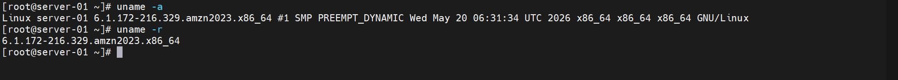

## Why I Ran This Command

To identify the Linux kernel version, architecture, and hostname.

## What I Learned

Before troubleshooting any system, understanding the operating system and kernel version is important because behavior can differ across Linux distributions.

## Observation

System information was displayed successfully.

---

# Step 2: Check Operating System Details

## Command

```bash
cat /etc/os-release
```

## Screenshot

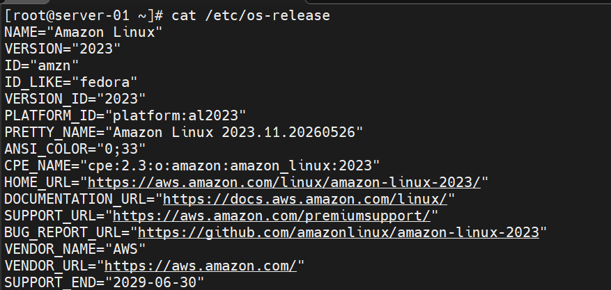

## Why I Ran This Command

To determine the Linux distribution and version.

## What I Learned

Knowing the operating system helps in locating logs and using the correct troubleshooting commands.

## Observation

Ubuntu operating system details were displayed successfully.

---

# Step 3: Filesystem Sanity Check

## Command

```bash
mkdir /tmp/runbook-demo
```

## Why I Ran This Command

To verify that directory creation works correctly.

## What I Learned

Filesystem checks help verify that storage is functioning properly.

## Observation

Directory was created successfully.

---

# Step 4: Verify File Operations

## Command

```bash
cp /etc/hosts /tmp/runbook-demo/hosts-copy
ls -l /tmp/runbook-demo
```

## Screenshot

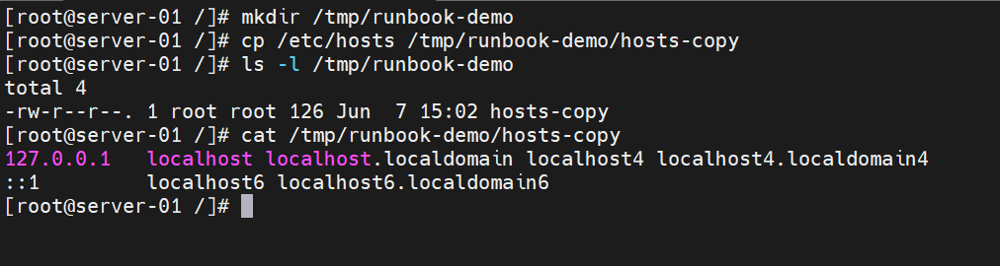

## Why I Ran This Command

To verify file copying and listing operations.

## What I Learned

File operations are basic but important checks during troubleshooting.

## Observation

The file was copied and verified successfully.

---

# Step 5: CPU Monitoring

## Command

```bash
top
```

## Screenshot

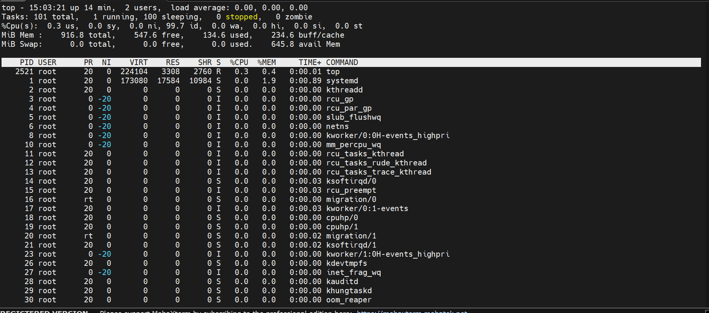

## Why I Ran This Command

To monitor CPU utilization and active processes.

## What I Learned

High CPU usage often indicates performance problems.

## Observation

CPU utilization appeared normal.

---

# Step 6: Memory Monitoring

## Command

```bash
free -h
```

## Why I Ran This Command

To verify memory usage and available RAM.

## What I Learned

Insufficient memory can slow down applications and services.

## Observation

Memory usage was healthy and available memory was sufficient.

---

# Step 7: Disk Space Check

## Command

```bash
df -h
```

## Screenshot

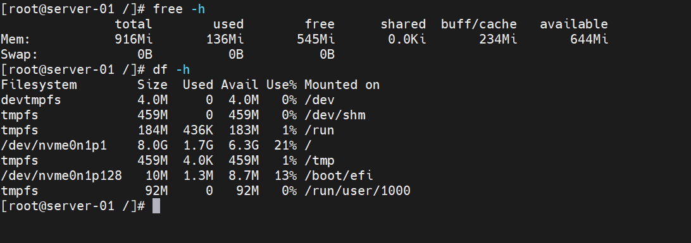

## Why I Ran This Command

To check available disk space.

## What I Learned

A full disk can cause application failures and logging issues.

## Observation

Disk usage was within acceptable limits.

---

# Step 8: Log Storage Check

## Command

```bash
du -sh /var/log
```

## Screenshot

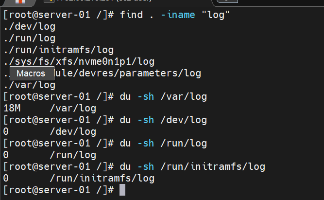

## Why I Ran This Command

To check how much space log files consume.

## What I Learned

Large log files can eventually fill up disk storage.

## Observation

Log directory size was reasonable.

---

# Step 9: Network Inspection

## Command

```bash
ss -tulpn
```

## Screenshot

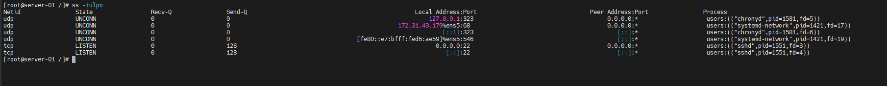

## Why I Ran This Command

To inspect listening services and open ports.

## What I Learned

Open ports help identify which services are currently running.

## Observation

Several active services were listening on network ports.

---

# Step 10: Connectivity Test

## Command

```bash
ping google.com -c 4
```

## Screenshot

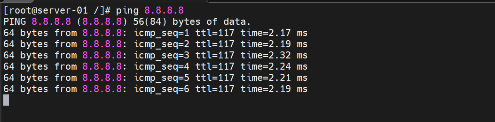

## Why I Ran This Command

To verify internet connectivity and DNS resolution.

## What I Learned

Connectivity tests help quickly identify network issues.

## Observation

Network connectivity was working successfully.

---

# Step 11: Service Inspection

## Command

```bash
systemctl status sshd
```

## Screenshot

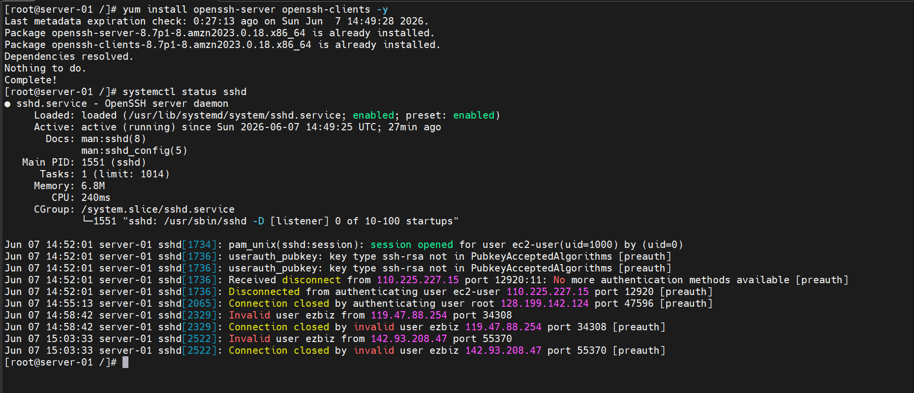

## Why I Ran This Command

To verify the health and status of the SSH service.

## What I Learned

Service status provides information about uptime, PID, and recent activity.

## Observation

SSH service was active and running.

---

# Step 12: Service Log Review

## Command

```bash
journalctl -u ssh -n 50
```

## Screenshot

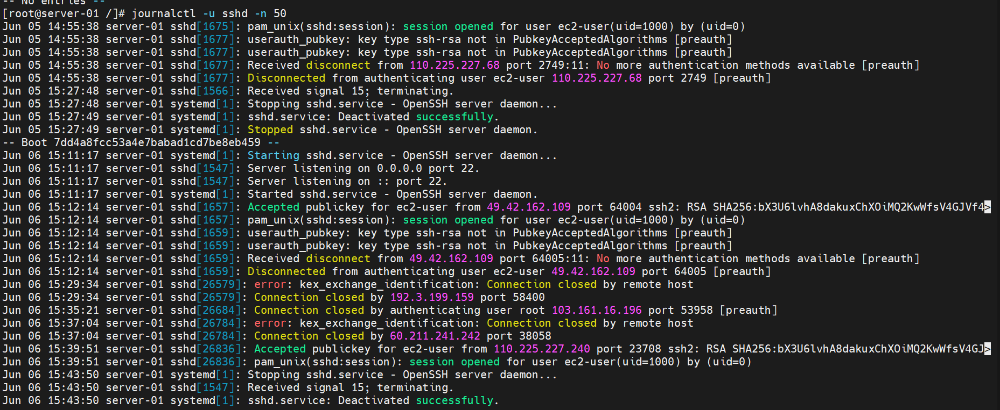

## Why I Ran This Command

To review recent SSH service logs.

## What I Learned

Logs are often the best source of information during troubleshooting.

## Observation

No critical errors were found.

---

# Step 13: System Log Review

## Command

```bash
tail -n 50 /var/log/syslog
```

## Screenshot

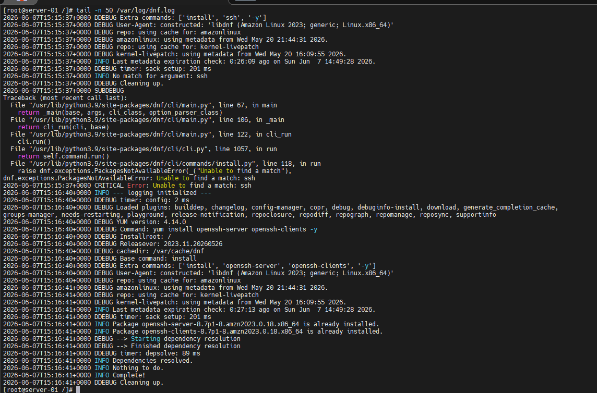

## Why I Ran This Command

To inspect recent system events and messages.

## What I Learned

System logs provide valuable insight into overall system health.

## Observation

Recent logs appeared normal.

---

# Quick Findings

After completing the troubleshooting drill, I observed:

- CPU usage was normal.
- Memory usage was healthy.
- Disk space was available.
- Log directory size was reasonable.
- Network connectivity was working.
- SSH service was healthy.
- No critical errors were found in the logs.

---

# If This Worsens

If the SSH service starts failing in the future, I would:

1. Restart the SSH service.
2. Review more detailed logs.
3. Collect diagnostic information using tools such as strace.
4. Monitor resource utilization over time.
5. Escalate if the issue affects availability.

---

# What I Learned

Today I learned how to follow a structured troubleshooting workflow. Instead of guessing, I collected information from system resources, services, and logs before drawing conclusions. This exercise helped me understand how Linux administrators and DevOps engineers investigate issues in real-world environments.