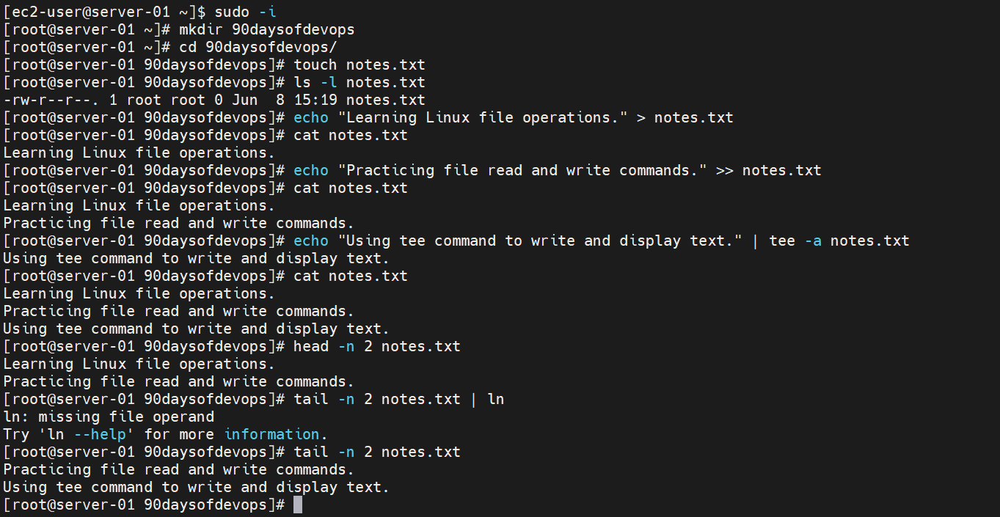

# Day 06 – File I/O Practice

## Objective

The goal of this exercise was to practice basic file creation, writing, appending, and reading operations in Linux.

---

## Step 1: Create a File

### Command

```bash
touch notes.txt
```

### Observation

Created an empty file named notes.txt.

---

## Step 2: Write Content

### Command

```bash
echo "Learning Linux file operations." > notes.txt
```

### Observation

Added the first line to the file using output redirection.

---

## Step 3: Append Content

### Command

```bash
echo "Practicing file read and write commands." >> notes.txt
```

### Observation

Added a new line without overwriting existing content.

---

## Step 4: Use tee Command

### Command

```bash
echo "Using tee command to write and display text." | tee -a notes.txt
```

### Observation

Displayed text on screen and appended it to the file.

---

## Step 5: Read Full File

### Command

```bash
cat notes.txt
```

### Observation

Displayed the entire contents of the file.

---

## Step 6: Read Beginning of File

### Command

```bash
head -n 2 notes.txt
```

### Observation

Displayed the first two lines of the file.

---

## Step 7: Read End of File

### Command

```bash
tail -n 2 notes.txt
```

### Observation

Displayed the last two lines of the file.

---

## What I Learned

Today I learned how to create files, write content, append new lines, and read file contents using Linux commands such as touch, echo, cat, head, tail, and tee. These commands are important for working with configuration files, logs, and scripts in Linux and DevOps environments.

**Output**

