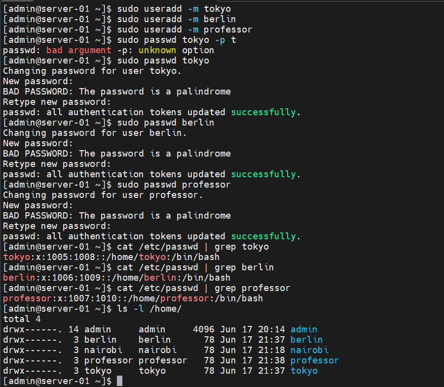
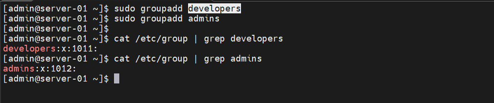
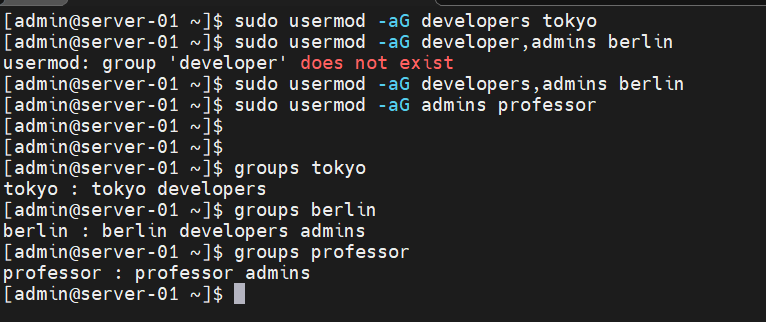
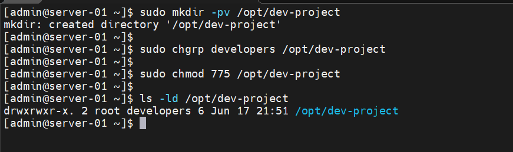
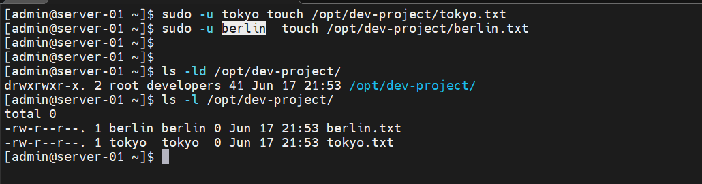
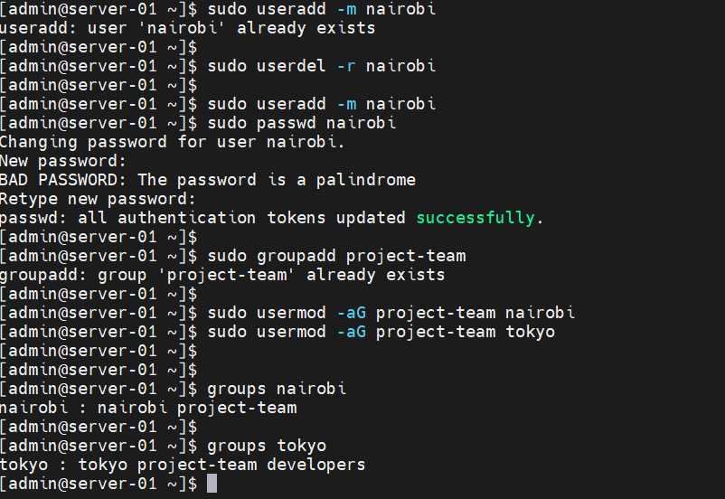
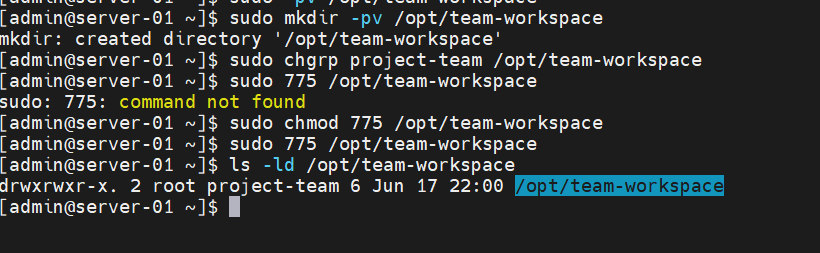
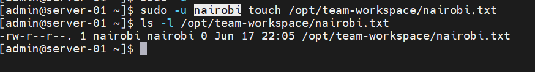

# Day 09 – Linux User & Group Management Challenge

## 90-day Devops Learning plan

## Objective

The goal of this exercise was to learn Linux user and group management by creating users, assigning groups, configuring permissions, and testing shared directory access.

---

# Task 1: Create Users

## Users Created

- tokyo
- berlin
- professor

### Commands

```bash
sudo useradd -m tokyo
sudo useradd -m berlin
sudo useradd -m professor

sudo passwd tokyo
sudo passwd berlin
sudo passwd professor
```

### Verify Users

```bash
cat /etc/passwd | grep tokyo
cat /etc/passwd | grep berlin
cat /etc/passwd | grep professor

ls -l /home
```

### Screenshot



### Observation

Successfully created three users with their own home directories.

### What I Learned

The `useradd -m` command creates both a user account and a home directory.

---

# Task 2: Create Groups

## Groups Created

- developers
- admins

### Commands

```bash
sudo groupadd developers
sudo groupadd admins
```

### Verify Groups

```bash
cat /etc/group | grep developers
cat /etc/group | grep admins
```

### Screenshot



### Observation

Both groups were successfully created.

### What I Learned

Groups help organize users and simplify permission management.

---

# Task 3: Assign Users to Groups

## Group Assignments

| User | Group Membership |
|--------|--------|
| tokyo | developers |
| berlin | developers, admins |
| professor | admins |

### Commands

```bash
sudo usermod -aG developers tokyo

sudo usermod -aG developers,admins berlin

sudo usermod -aG admins professor
```

### Verify

```bash
groups tokyo
groups berlin
groups professor
```

### Screenshot



### Observation

Users were successfully added to the required groups.

### What I Learned

A user can belong to multiple groups and inherit permissions from those groups.

---

# Task 4: Shared Directory for Developers

## Create Directory

```bash
sudo mkdir -p /opt/dev-project
```

## Assign Group Ownership

```bash
sudo chgrp developers /opt/dev-project
```

## Set Permissions

```bash
sudo chmod 775 /opt/dev-project
```

## Verify

```bash
ls -ld /opt/dev-project
```

### Screenshot



### Observation

Directory permissions were set to:

```text
drwxrwxr-x
```

Group members can read, write, and execute.

---

## Test Access as Tokyo

```bash
sudo -u tokyo touch /opt/dev-project/tokyo.txt
```

## Test Access as Berlin

```bash
sudo -u berlin touch /opt/dev-project/berlin.txt
```

## Verify Files

```bash
ls -l /opt/dev-project
```

### Screenshot



### Observation

Both users successfully created files inside the shared directory.

### What I Learned

Group ownership combined with permissions allows multiple users to collaborate safely.

---

# Task 5: Team Workspace

## Create User

```bash
sudo useradd -m nairobi
sudo passwd nairobi
```

## Create Group

```bash
sudo groupadd project-team
```

## Add Users to Group

```bash
sudo usermod -aG project-team nairobi

sudo usermod -aG project-team tokyo
```

## Verify

```bash
groups nairobi
groups tokyo
```

### Screenshot



---

## Create Workspace

```bash
sudo mkdir -p /opt/team-workspace
```

## Assign Group

```bash
sudo chgrp project-team /opt/team-workspace
```

## Set Permissions

```bash
sudo chmod 775 /opt/team-workspace
```

## Verify

```bash
ls -ld /opt/team-workspace
```

### Screenshot



---

## Test Access

```bash
sudo -u nairobi touch /opt/team-workspace/test.txt
```

## Verify

```bash
ls -l /opt/team-workspace
```

### Screenshot



### Observation

Nairobi successfully created files inside the team workspace.

### What I Learned

Shared directories allow teams to work together while maintaining controlled access.

---


# Key Takeaways

- Learned how to create Linux users and groups.
- Learned how to assign users to multiple groups.
- Learned how Linux permissions work.
- Learned how to manage shared directories using group ownership.
- Understood how DevOps teams use users, groups, and permissions to control access.

---

# What I Learned

Today I practiced Linux user and group management through a hands-on challenge. I created users, assigned groups, configured shared directories, tested access permissions, and verified group memberships. This exercise helped me understand how Linux manages access control and how DevOps teams securely collaborate on shared systems.