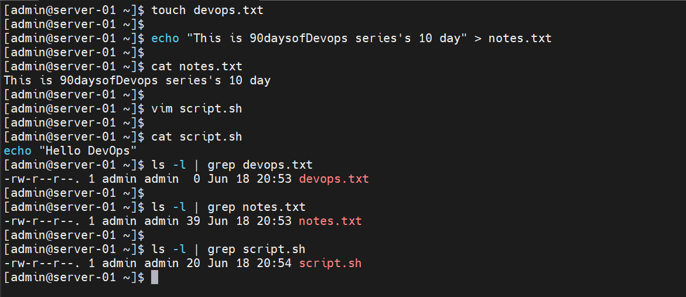
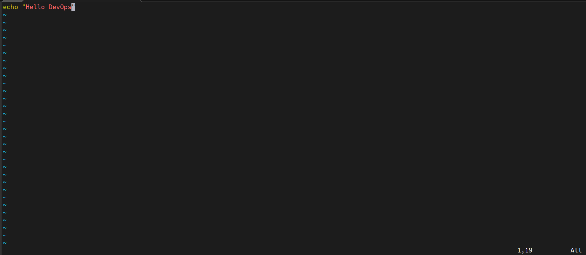
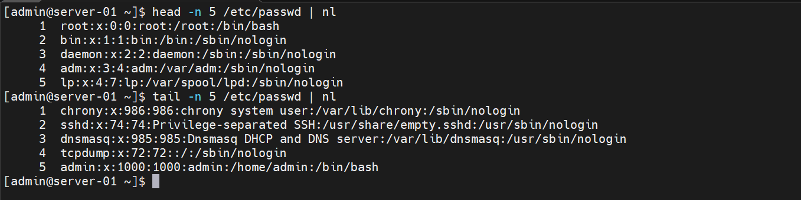
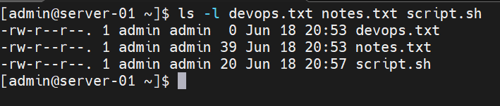
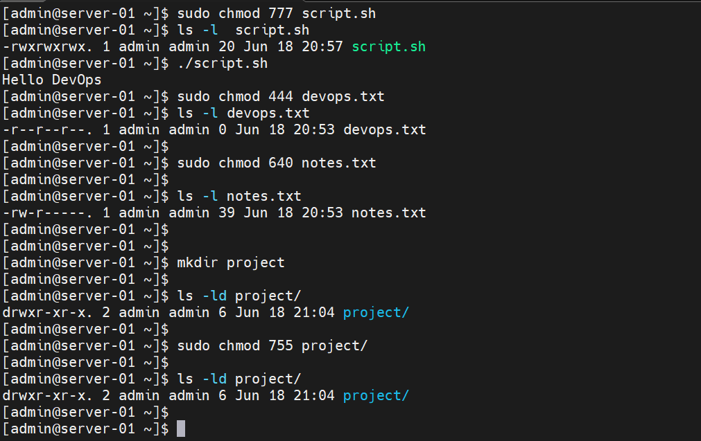
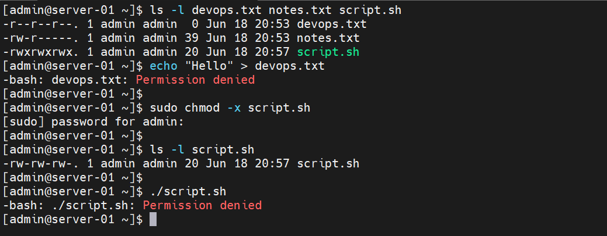

# Day 10 – File Permissions & File Operations Challenge

## 90-day Devops Learning plan

## Objective

The goal of this challenge was to understand Linux file operations and file permissions. I practiced creating files, reading file contents, modifying permissions, executing scripts, and troubleshooting permission-related issues.

---

# Task 1: Create Files

## Create devops.txt

### Command

```bash
touch devops.txt
```

### Observation

Successfully created an empty file named `devops.txt`.

---

## Create notes.txt

### Command

```bash
echo "Linux file permissions are important." > notes.txt
```

### Observation

Created a file and added content using output redirection.

---

## Create script.sh

### Command

```bash
vim script.sh
```

### Content

```bash
echo "Hello DevOps"
```

### Observation

Created a shell script that prints a message.

---

## Verify Files

### Command

```bash
ls -l
```

### Observation

Verified that all files were created successfully.


---

# Task 2: Read Files

## Read notes.txt

### Command

```bash
cat notes.txt
```
### Observation

Displayed the complete file contents.

---

## View script.sh in Read-Only Mode

### Command

```bash
vim -R script.sh
```



### Observation

Opened the file in read-only mode.

---

## Display First 5 Lines of /etc/passwd

### Command

```bash
head -n 5 /etc/passwd
```

### Observation

Displayed the first five lines of the passwd file.

---

## Display Last 5 Lines of /etc/passwd

### Command

```bash
tail -n 5 /etc/passwd
```


### Observation

Displayed the last five lines of the passwd file.



---

# Task 3: Understanding Permissions

## Check Current Permissions

### Command

```bash
ls -l devops.txt notes.txt script.sh
```



### Observation

Example output:

```text
-rw-r--r-- devops.txt
-rw-r--r-- notes.txt
-rw-r--r-- script.sh
```

### Permission Breakdown

| Symbol | Meaning |
|----------|----------|
| r | Read |
| w | Write |
| x | Execute |

### Numeric Values

| Permission | Value |
|------------|--------|
| Read | 4 |
| Write | 2 |
| Execute | 1 |

Example:

```text
rwx = 7
rw- = 6
r-- = 4
```

### What I Learned

Linux permissions are divided into:

- Owner
- Group
- Others

---

# Task 4: Modify Permissions

## Make script.sh Executable

### Command

```bash
chmod +x script.sh
```

### Verify

```bash
ls -l script.sh
```

### Run Script

```bash
./script.sh
```

### Observation

The script executed successfully and displayed:

```text
Hello DevOps
```

---

## Make devops.txt Read-Only

### Command

```bash
chmod 444 devops.txt
```

### Verify

```bash
ls -l devops.txt
```


### Observation

Write permissions were removed for all users.

---

## Set notes.txt Permission to 640

### Command

```bash
chmod 640 notes.txt
```

### Verify

```bash
ls -l notes.txt
```

### Observation

Permissions changed successfully.

```text
-rw-r-----
```

Meaning:

- Owner → Read & Write
- Group → Read Only
- Others → No Access

---

## Create Directory with 755 Permission

### Command

```bash
mkdir project
chmod 755 project
```

### Verify

```bash
ls -ld project
```


### Observation

Directory permissions:

```text
drwxr-xr-x
```

Meaning:

- Owner → Full Access
- Group → Read & Execute
- Others → Read & Execute



---

# Task 5: Permission Testing

## Test Writing to Read-Only File

### Command

```bash
echo "Hello" >> devops.txt
```

### Observation

The operation failed because write permissions had been removed.

---

## Test Script Without Execute Permission

### Remove Execute Permission

```bash
chmod -x script.sh
```

### Execute Script

```bash
./script.sh
```


### Observation

Received a permission-related error because execute permission was removed.



---

---

# Key Learnings

1. Linux permissions control access to files and directories.
2. The chmod command is used to modify permissions.
3. Execute permission is required to run shell scripts.
4. Numeric permissions such as 755 and 640 provide precise access control.
5. Proper permissions are essential for Linux security and DevOps administration.

---

# Conclusion

Today, I learned how to create files, read file contents, understand Linux permission structures, modify permissions, execute shell scripts, and troubleshoot permission issues. This challenge helped me understand how Linux security works and why file permissions are critical in real-world DevOps environments.