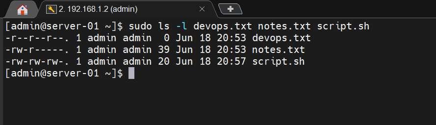
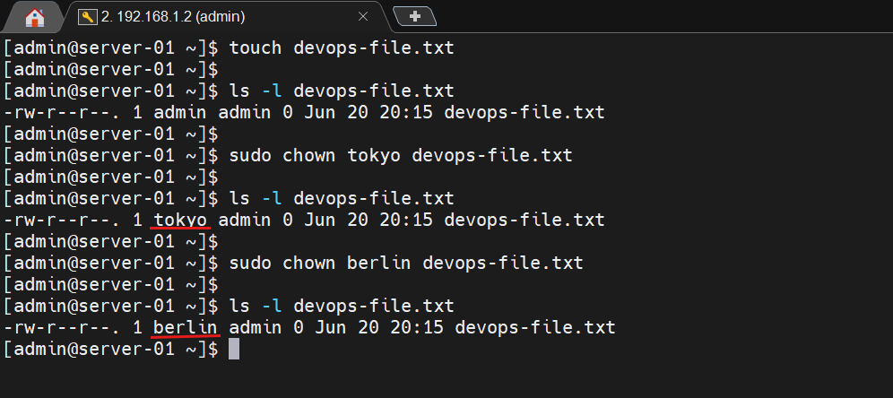
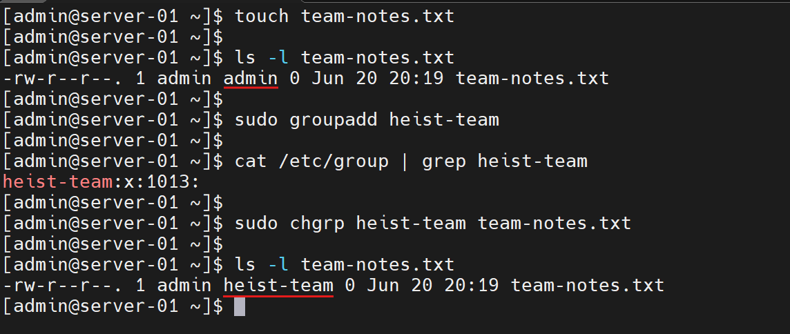
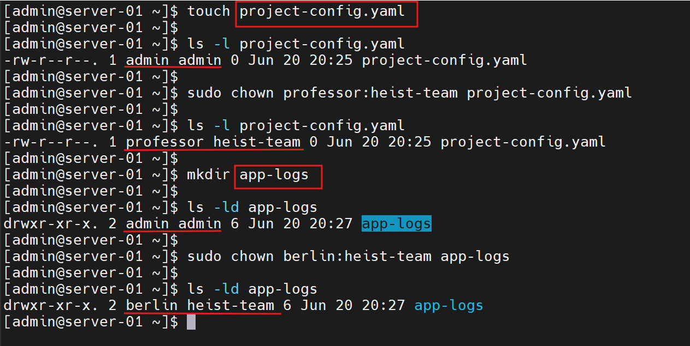
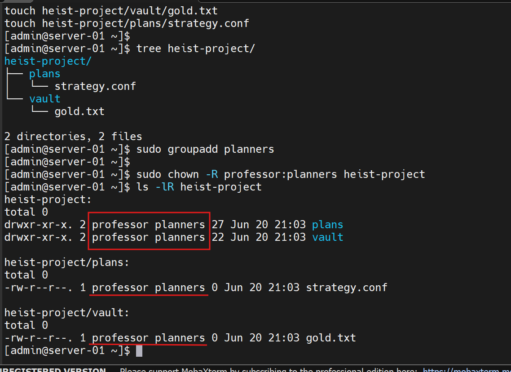
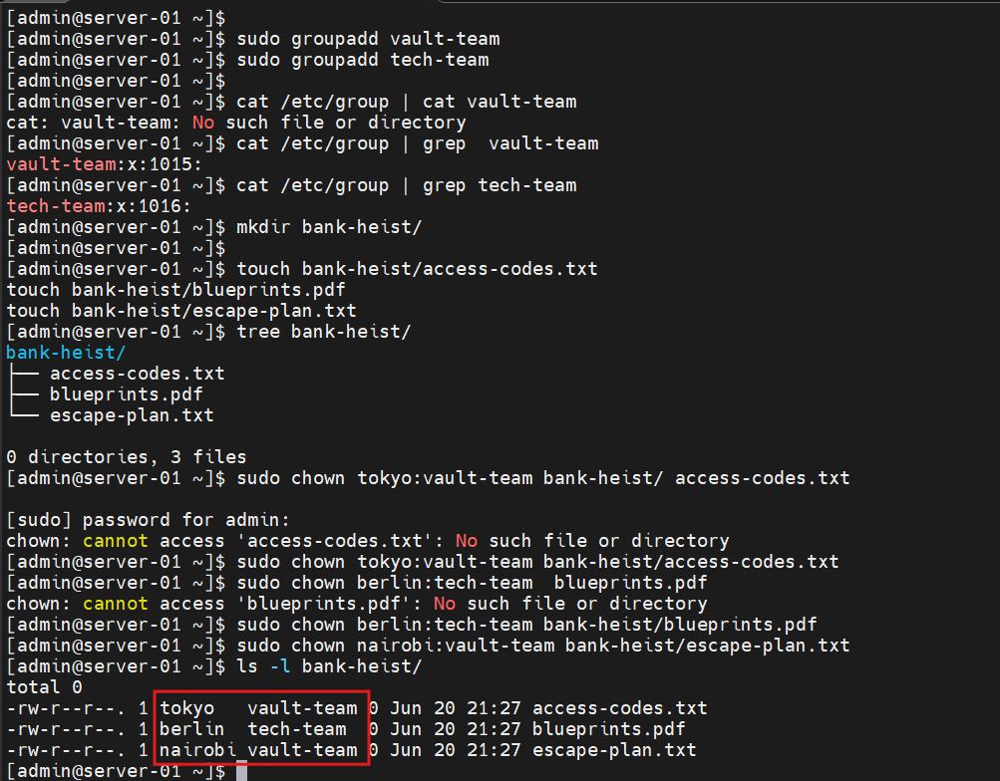

# Day 11 – File Ownership Challenge

## 90-Day DevOps Learning Plan

## Objective

The goal of this challenge was to understand Linux file ownership and group management. I practiced viewing ownership information, changing file owners, modifying groups, assigning owner and group together, and applying recursive ownership changes using `chown` and `chgrp`.

---

# Task 1: Understanding Ownership

## Check Current Ownership

### Command

```bash
ls -l devops.txt notes.txt script.sh
```

### Observation

Displayed the ownership details of files.

Example Output:

```text
-r--r--r--. 1 admin admin 0 Jun 18 20:53 devops.txt
-rw-r--r--. 1 admin admin 39 Jun 18 20:53 notes.txt
-rw-rw-rw-. 1 admin admin 20 Jun 18 20:57 script.sh
```

### Ownership Format

```text
-rw-r--r-- 1 owner group size date filename
```

### What I Learned

- Owner is the user who owns the file.
- Group is a collection of users who can share access to files.
- Every file in Linux has an owner and a group.



---

# Task 2: Basic chown Operations

## Create File

### Command

```bash
touch devops-file.txt
```

### Observation

Created an empty file named `devops-file.txt`.

---

## Verify Current Owner

### Command

```bash
ls -l devops-file.txt
```

### Observation

Checked the current owner and group of the file.

---

## Change Owner to tokyo

### Command

```bash
sudo chown tokyo devops-file.txt
```

### Observation

Changed the owner from `admin` to `tokyo`.

---

## Change Owner to berlin

### Command

```bash
sudo chown berlin devops-file.txt
```

### Observation

Changed the owner from `tokyo` to `berlin`.

---

## Verify Ownership

### Command

```bash
ls -l devops-file.txt
```

### Observation

Verified that ownership changed successfully.



---

# Task 3: Basic chgrp Operations

## Create File

### Command

```bash
touch team-notes.txt
```

### Observation

Created a new file.

---

## Check Current Group

### Command

```bash
ls -l team-notes.txt
```

### Observation

Verified the current group ownership.

---

## Create Group

### Command

```bash
sudo groupadd heist-team
```

### Observation

Created a new group named `heist-team`.

---

## Verify Group Creation

### Command

```bash
cat /etc/group | grep heist-team
```

### Observation

Confirmed that the group exists.

---

## Change Group Ownership

### Command

```bash
sudo chgrp heist-team team-notes.txt
```

### Observation

Changed file group ownership successfully.

---

## Verify

### Command

```bash
ls -l team-notes.txt
```

### Observation

Group changed from:

```text
admin → heist-team
```



---

# Task 4: Combined Owner & Group Change

## Create File

### Command

```bash
touch project-config.yaml
```

### Observation

Created a configuration file.

---

## Change Owner and Group Together

### Command

```bash
sudo chown professor:heist-team project-config.yaml
```

### Observation

Changed both owner and group using a single command.

---

## Verify

### Command

```bash
ls -l project-config.yaml
```

### Observation

Ownership became:

```text
professor:heist-team
```

---

## Create Directory

### Command

```bash
mkdir app-logs
```

### Observation

Created a directory named `app-logs`.

---

## Change Directory Ownership

### Command

```bash
sudo chown berlin:heist-team app-logs
```

### Observation

Changed ownership of the directory.

---

## Verify

### Command

```bash
ls -ld app-logs
```

### Observation

Verified the updated ownership.



---

# Task 5: Recursive Ownership

## Create Directory Structure

### Commands

```bash
mkdir -p heist-project/vault

mkdir -p heist-project/plans

touch heist-project/vault/gold.txt

touch heist-project/plans/strategy.conf
```

### Observation

Created a project directory with subdirectories and files.

---

## Create Group

### Command

```bash
sudo groupadd planners
```

### Observation

Created a new group called `planners`.

---

## Change Ownership Recursively

### Command

```bash
sudo chown -R professor:planners heist-project
```

### Observation

Applied ownership changes to:

- Parent directory
- Subdirectories
- All files inside directories

The `-R` option performs recursive changes.

---

## Verify

### Command

```bash
ls -lR heist-project
```

### Observation

Verified that all files and directories now belong to:

```text
Owner : professor
Group : planners
```



---

# Task 6: Practice Challenge

## Create Groups

### Commands

```bash
sudo groupadd vault-team

sudo groupadd tech-team
```

### Observation

Created the required groups.

---

## Create Directory

### Command

```bash
mkdir bank-heist
```

### Observation

Created a directory named `bank-heist`.

---

## Create Files

### Commands

```bash
touch bank-heist/access-codes.txt

touch bank-heist/blueprints.pdf

touch bank-heist/escape-plan.txt
```

### Observation

Created three files inside the directory.

---

## Assign Ownership

### Access Codes File

```bash
sudo chown tokyo:vault-team bank-heist/access-codes.txt
```

### Blueprint File

```bash
sudo chown berlin:tech-team bank-heist/blueprints.pdf
```

### Escape Plan File

```bash
sudo chown nairobi:vault-team bank-heist/escape-plan.txt
```

### Observation

Assigned different owners and groups to each file.

---

## Verify

### Command

```bash
ls -l bank-heist
```

### Observation

Verified ownership assignments successfully.

| File | Owner | Group |
|--------|--------|--------|
| access-codes.txt | tokyo | vault-team |
| blueprints.pdf | berlin | tech-team |
| escape-plan.txt | nairobi | vault-team |



---

# Key Learnings

1. Every Linux file has an owner and a group.
2. The `chown` command changes file ownership.
3. The `chgrp` command changes group ownership.
4. `chown owner:group` changes both owner and group together.
5. Recursive ownership changes can be performed using the `-R` option.
6. Proper ownership management is important for Linux security and DevOps administration.

---

# Conclusion

Today, I learned how Linux file ownership works and how to manage users and groups using `chown` and `chgrp`. I practiced changing ownership for files, directories, and complete directory structures. Understanding ownership management is important for Linux administration, DevOps workflows, CI/CD pipelines, application deployments, and server security.
